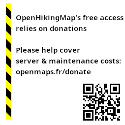

## ❤️ Funding openmaps.fr

[Openmaps.fr (See presentation page)](https://openmaps.fr/about-openmaps.fr.html) based on [OpenStreetMap](https://wiki.openstreetmap.org/) datas provides both [OpenTopoMap-R](https://github.com/sletuffe/OpenTopoMap) and [OpenHikingMap](https://wiki.openstreetmap.org/wiki/OpenHikingMap) free of charge for reasonable volume (<400k tiles) and non-commercial services. However, operating and renting servers is not free. There are two crowdfunding platforms to help fund the project:

* <a href="https://ko-fi.com/openmapsfr">  ko-fi.com/openmapsfr</a>: 1.5% fee + 0.25 cents and allows for one-time donations as well as recurring ones. **Preferred**, because there is a target and a counter to track progress toward the yearly costs.

* <a href="https://liberapay.com/openmaps.fr">  liberapay.com/openmaps.fr</a>: 1.5% fee + 0.25 cents, focused on recurring donations (unless you cancel the donation later).

## What are those funds used for ?

For the 2026 expenses:

* Server cost (hosting and renting). See [Openmaps.fr (See presentation page)](https://openmaps.fr/about-openmaps.fr.html) for details about the current server (889 € /year) or the [2026 year's bill](https://openmaps.fr/Facture_FR74417751.pdf) (redacted from my personal information for privacy). I also use a less powerful backup server, otherwise used for professional purposes, which can only act as a temporary failover — its cost isn't counted here.

* Domain name openmaps.fr (~8€ /year)

* 2 days a year of time spent on maintenance, OSM data re-import, and blocking excessive usage or abuse (~500 € /year)

> **Note:** during 2026, donations weren't quite enough to cover these costs — possibly because users simply weren't aware of the situation. So, since September 2026, I've been trying to inform users by showing a substitute tile on about 0.5% of requests (roughly 1 tile in 200), asking for a donation. **Once the yearly costs are covered, I'll turn that tile off until the following year.**
>
> 
